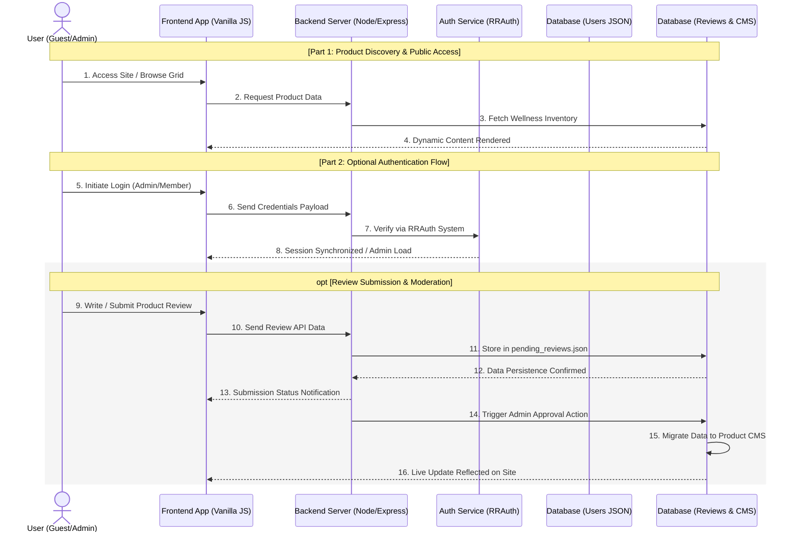

# Project Report: Wellness Product Ecommerce Website

  <h1>Table of Contents</h1>

1 Introduction ...................................................................................................................................... 1
&nbsp;&nbsp;&nbsp;&nbsp;1.1 Overview of the existing project ......................................................................................... 1
&nbsp;&nbsp;&nbsp;&nbsp;1.2 Principal Technical Features ................................................................................................. 1
&nbsp;&nbsp;&nbsp;&nbsp;&nbsp;&nbsp;&nbsp;&nbsp;1.2.1 Product Discovery and Filtering Logic ..................................................................... 1
&nbsp;&nbsp;&nbsp;&nbsp;&nbsp;&nbsp;&nbsp;&nbsp;1.2.2 Real-time Search Engine Integration ........................................................................ 1
&nbsp;&nbsp;&nbsp;&nbsp;&nbsp;&nbsp;&nbsp;&nbsp;1.2.3 Secure Role-Based Authentication (RRAuth) .......................................................... 1
&nbsp;&nbsp;&nbsp;&nbsp;&nbsp;&nbsp;&nbsp;&nbsp;1.2.4 Dynamic Content REST API Architecture ................................................................ 1
&nbsp;&nbsp;&nbsp;&nbsp;&nbsp;&nbsp;&nbsp;&nbsp;1.2.5 User Interaction and Review Moderation System ................................................. 1
&nbsp;&nbsp;&nbsp;&nbsp;&nbsp;&nbsp;&nbsp;&nbsp;1.2.6 Responsive Cross-Device Architecture ................................................................... 1
2 Literature Survey/ Related Works ................................................................................................... 3
3 Problem Definition ............................................................................................................................... 4
4 Objectives .............................................................................................................................................. 5
5 Methodology .......................................................................................................................................... 6
&nbsp;&nbsp;&nbsp;&nbsp;5.1 Process model ............................................................................................................................ 6
&nbsp;&nbsp;&nbsp;&nbsp;5.2 Modules .................................................................................nbsp;&nbsp;&nbsp;&nbsp;&nbsp;&nbsp;&nbsp;&nbsp;&nbsp;&nbsp;&nbsp;&nbsp;&nbsp;&nbsp;&nbsp;&nbsp;&nbsp;&nbsp;&nbsp;&nbsp;&nbsp; 7
&nbsp;&nbsp;&nbsp;&nbsp;5.3 Process flow visualization ...................................................................................................... 9
6 Work done So Far ............................................................................................................................... 11
7 Future Work ......................................................................................................................................... 14
References ................................................................................................................................................ 14

---

## 1 Introduction

### 1.1 Overview of the existing project
The **Wellness Product Ecommerce Website** is a specialized web-based application designed to facilitate efficient product discovery, data management, and customer interaction. During my internship at **Ganglia Technologies Pvt. Ltd.**, I worked on enhancing and optimizing this system to improve its performance, usability, and scalability.

The application serves as a comprehensive digital platform for premium wellness products. It enables users to navigate a high-performance interface, interact with real-time search and filtering systems, and maintain secure profiles through a custom role-based authentication module. The system architecture follows a modular design utilizing **Node.js** and **Express 5.x** on the backend, paired with a performance-optimized frontend that ensures low-latency user interactions and high visual fidelity.

Key architectural pillars include a centralized REST API for dynamic content delivery, a JSON-based data store for reliability, and a robust administrative moderation layer for managing user feedback and site configuration. By decoupling the presentation layer from the core logic, the project achieves a high degree of maintainability and flexibility, making it adaptable to future enterprise expansions.

Ultimately, the system plays a crucial role in bridging the gap between digital wellness product discovery and technical platform efficiency, allowing customers to find targeted solutions and administrators to optimize operational workflows through real-time data insights.

### 1.2 Principal Technical Features
The **Principal Technical Features** of the platform combine advanced client-side interactivity with a robust backend architecture to deliver a premium e-commerce experience. By integrating real-time search and filtering engines with a secure, role-based authentication system (**RRAuth**), the project ensures both high searchability for users and complete control for administrators. Supported by a dynamic **Express-based REST API** and a mobile-first responsive design, the platform achieves a seamless data-driven workflow that prioritizes site performance, user interaction through review moderation, and cross-device visual consistency.

The following features represent the core technical implementations currently active within the project:

#### 1.2.1 Product Discovery and Filtering Logic
- **Implementation**: Managed via `public/js/custom.js`.
- **Details**: A client-side engine that allows users to sort products by price (ascending/descending) and alphabetically. It also includes category-based filtering using data-attribute selectors for instant UI updates without page reloads.

#### 1.2.2 Real-time Search Engine Integration
- **Implementation**: Managed via `public/js/search-logic.js`.
- **Details**: An asynchronous search module that provides instant product suggestions and visual results as the user types. It features an overlay results system that integrates directly with the site's global navigation.

#### 1.2.3 Secure Role-Based Authentication (RRAuth)
- **Implementation**: Managed via `public/js/auth.js`.
- **Details**: A custom authentication module providing role-based access control (RBAC). It supports user registration, secure login sessions, and administrative privilege escalation (e.g., for accessing moderation features). Sessions are persisted using secure local storage synchronization with the server.

#### 1.2.4 Dynamic Content API System
- **Implementation**: Handled by the **`server.js`** file.
- **Details**: This acts as the "bridge" between the database and the website. It uses **Express** to send information (like product prices and descriptions) to the frontend in a clean format (JSON). By keeping the data separate from the design, the website becomes much easier to update and manage without affecting the visual layout.

#### 1.2.5 User Interaction and Review Moderation System
- **Implementation**: Managed via `server.js` and `public/js/reviews.js`.
- **Details**: A dual-layered review system allowing users to submit product feedback. Submissions are stored in a pending state (`pending_reviews.json`) and require administrative approval via a dedicated API endpoint before appearing live on the site.

#### 1.2.6 Responsive Cross-Device Architecture
**Implementation and Details**: The website utilizes a **mobile-first** design built with **CSS Flexbox and Grid**. By applying specific technical breakpoints, the interface automatically optimizes complex components like headers, footers, and side-carts for any screen size. This ensures a fluid, high-performance experience across smartphones, tablets, and desktops.

**Overall Summary**: The implementation of these technical enhancements has significantly optimized the functionality and user engagement of the **Wellness Product Ecommerce Website**. By engineering real-time search, multi-dimensional filtering, and the secure **RRAuth** module, we have decentralized the data management workflow and enhanced search utility. These developments deliver a high-performance, mobile-first experience for customers while empowering administrators with streamlined moderation and inventory controls.

---

## 2 Literature Survey/ Related Works
Modern e-commerce has moved away from old "all-in-one" systems toward a new approach where the front part of the website (what users see) and the back part (where data is stored) are kept separate. This is known as "headless commerce." By keeping these parts separate, the website becomes much more flexible and faster. This setup allows developers to update the design without touching the database, making the whole system easier to manage and less likely to break during high traffic.

Site speed is one of the most important factors for keeping customers happy on a wellness website. Research shows that if a page takes too long to load, users will quickly leave the site. To prevent this, modern websites use "asynchronous logic," which means parts of the page can update instantly without a full reload. By optimizing images and code, developers can ensure the site feels fast and responsive, which is critical for maintaining user engagement.

As websites move more logic to the browser, security has become even more important. Modern security focuses on checking every single request for data to make sure no unauthorized person can access private information. Systems like "Role-Based Access Control" (RBAC) ensure that regular customers can only see products, while administrators have special permission to manage reviews and product details. This keeps the platform secure and builds trust with the users.

Modern web applications depend on a simple data format called JSON to move information from the server to the screen. Because JSON is lightweight and easy for computers to read, it has become the standard for "RESTful APIs," which act as the bridge for data. This modular setup means that the backend database could be changed or connected to other professional tools in the future without having to redesign the entire visual part of the website.

Finally, having a website that works perfectly on mobile phones is no longer optional; it is a requirement. Developers use modern layout tools like "Flexbox" and "Grid" to make sure the website automatically rearranges itself to fit any screen size, whether it's a small smartphone or a large desktop. Research into mobile design shows that features like "slide-out menus" and "easy-to-tap buttons" are essential for providing a smooth, app-like experience for users on the go.

---

## 3 Problem Definition
One of the primary challenges in modern wellness portals is the high level of navigational complexity. When e-commerce platforms grow their inventories, users often struggle to find specific products among hundreds of different categories. Without advanced sorting and real-time filtering systems, customers are forced to scroll through irrelevant items, which leads to frustration and eventually causes them to abandon their shopping carts before completing a purchase.

Another significant issue is performance latency caused by outdated web architectures. Many traditional websites use heavy, unoptimized designs that take too long to load, especially on mobile devices with slower internet connections. Recent data shows that even a few seconds of lag can significantly increase bounce rates. Without a lightweight and decoupled system (like headless commerce), these platforms cannot deliver the fast, responsive experience that modern online shoppers expect.

Finally, there is a major gap in content trust and administrative oversight. Many online stores lack a verified review system that allows customers to share honest feedback about the quality of wellness supplements and products. Additionally, without a secure, role-based administration dashboard, it is difficult for site owners to moderate reviews or update product data in real-time. This lack of transparency and security makes users hesitant to trust the platform with their personal information and health choices.

Furthermore, traditional monolithic architectures create significant maintenance and scalability bottlenecks. In such systems, any minor update to a specific feature—like adding a new product filter or updating the search algorithm—requires a complete rebuild and redeployment of the entire platform. This lack of modularity makes it expensive and time-consuming to grow the website as new wellness categories and customer needs emerge. Without a decoupled system where features can be updated independently through specialized APIs, the platform remains rigid and difficult to scale.

Lastly, there is the ongoing challenge of maintaining data integrity and consistent presentation across multiple navigation channels. In many outdated systems, product data is often "hard-coded" or scattered across multiple files, leading to situations where a data change in the main inventory does not automatically update in the search results or specific product pages. This lack of synchronous data management creates a confusing experience for the user and an operational nightmare for the administrator. Building a centralized data engine that serves the same information to every part of the site simultaneously is a critical necessity for any professional e-commerce platform.

---

## 4 Objectives
The following objectives aim to enhance the functionality and aesthetic appeal of the **Wellness Product Ecommerce Website**, catering to the diverse needs of customers and enabling more effective product discovery and administrative oversight:

*   To design and implement a real-time product discovery engine with multi-dimensional filtering and search capabilities, enabling users to find targeted wellness products seamlessly.
*   To develop a secure, role-based authentication module (**RRAuth**) that manages user sessions and administrative privileges, ensuring data integrity and secure login flows within the platform.
*   To integrate a dual-layered review moderation system that allows users to submit product feedback and enables administrators to approve submissions via a dedicated API endpoint for verified content display.
*   To architect a premium, high-fidelity design system utilizing modern CSS3 Grid and Flexbox modules to create a "luxury" visual standard that reflects the high quality of wellness formulations.
*   To implement a decoupled, Express-based REST API for dynamic content delivery, facilitating seamless synchronization between the backend JSON store and the frontend interface for real-time updates.
*   To optimize the platform for cross-device usability through a mobile-first responsive architecture, ensuring high visual performance and consistent navigation on all screen sizes and input methods.

These objectives aim to enhance the technical versatility and user experience of the wellness platform’s core sections, catering to the diverse needs of users and enabling more effective search and transaction flows during digital shopping. Additionally, the objectives seek to introduce high-end design principles and secure data management features that open up new possibilities for scaling the platform into a comprehensive solution for premium health and wellness e-commerce.

---

## 5 Methodology
A systematic and structured approach was followed to achieve the objectives of the project. The development process involved multiple phases including analysis, design, development, testing and integration. An iterative and incremental approach was adopted, allowing for continuous refinement of the platform based on technical validation and visual audits.

### 5.1 Process model

**Requirement Gathering**: In this phase, modern wellness e-commerce standards were studied in detail to understand the necessary architecture, discovery modules, and secure interaction requirements. Technical gaps in traditional platforms, such as slow product discovery and UI inconsistencies, were analyzed. This phase helped in defining the technical scope of the **Wellness Product Ecommerce Website** and setting clear functional objectives.

**Design**: Based on the identified requirements, suitable architectural strategies were planned. This included engineering the REST API routes for dynamic data delivery, planning the modular JavaScript logic (`search-logic.js`, `auth.js`), and designing the responsive CSS3 layouts. The system architecture was reviewed to ensure the decoupling of the frontend UI from the backend JSON storage for better scalability.

**Development**: The required features and modular enhancements were implemented using a modern full-stack web environment:
*   **Frontend**: HTML5, CSS3 (Modern Grid/Flexbox), and JavaScript (ES6+).
*   **Backend**: Node.js and Express 5.x.
*   **Data Layer**: JSON-based File-System Data Storage.
During this phase, critical tasks such as real-time search logic, the **RRAuth** security module, side-cart drawer engineering, and Review API development were carried out.

**Testing**: Rigorous testing was performed to ensure the correctness and efficiency of the implemented modules. This included:
*   **Functional Testing**: Verification of the search results, product filtering, and user login flows.
*   **UI/UX Testing**: Auditing the responsiveness of the design across mobile and desktop breakpoints.
*   **API Performance Testing**: Ensuring low-latency data fetch cycles from the JSON engine.

**Integration**: All developed modules were integrated into a centralized technical ecosystem. This included syncing the Review Moderation API with the administrative dashboard and ensuring that the frontend UI elements could dynamically fetch and inject content from the backend JSON store. End-to-end checks verified the seamless interaction between the various JavaScript modules and the Express server.

**Deployment**: The system is designed for deployment on modern cloud platforms or local server environments. This involves configuring the Node.js runtime and staging the JSON-based inventory store for real-time production usage.

**Maintenance**: Ongoing maintenance involves updating the `products.json` and `homepage.json` files to reflect new offerings or visual changes. Bug fixes and performance refinements are implemented iteratively based on ongoing site audits.

The **Wellness Product Ecommerce Website** follows an iterative approach. Each phase, from the **Express API** to the **Discovery Engine**, builds on the previous one. Continuous testing of the **search engine** and **RRAuth** security ensures a high-performance, scalable platform optimized for the wellness sector.

### 5.2 Modules
The **Wellness Product Ecommerce Website** consists of multiple modular components that collectively provide a high-end experience for product management, user discovery, and system security.

➢ **Discovery & Search Module**:
*   **Real-time Search Engine**: Provides instant result overlays based on user input in `search-logic.js`.
*   **Multi-dimensional Filtering**: Enables users to sort and filter inventories by various wellness categories.
*   **Dynamic Result Injection**: Programmatically updates the DOM with matching product cards via JSON fetch.

➢ **Authentication & Security Module**:
*   **RRAuth System**: Manages secure access for both customers and administrators within `auth.js`.
*   **Role-Based Access Control**: Ensures that administrative tools are strictly partitioned from public views.
*   **Session Persistence**: Maintains secure user states using token-based logic and localized storage.

➢ **Interaction & Review Module**:
*   **Review Submission System**: Allows customers to provide feedback on specific wellness formulations.
*   **Moderation API**: Provides endpoints in `server.js` for administrators to approve pending reviews.
*   **Engagement Logs**: Tracks user submissions for administrative oversight and quality control.

➢ **Content API Module**:
*   **RESTful Routing**: Manages data flow between the frontend and the backend Express 5.x server.
*   **JSON Data Persistence**: Serves as the lightweight, high-performance database for inventory and settings.
*   **Asynchronous Fetch Cycle**: Powers data delivery without full-page reloads.

➢ **UI/UX & Responsive Module**:
*   **Adaptive Architecture**: Ensures full compatibility across mobile, tablet, and desktop viewports.
*   **Micro-Interaction Logic**: Handles high-end UI elements like side-cart drawers and sticky navigation.
*   **Design Token System**: Utilizes CSS Variables to maintain visual consistency across all site sections.

These modules collectively contribute to the high operational efficiency and visual fidelity of the wellness portal. By integrating discovery, security, and real-time interaction features, the system provides a comprehensive technical solution for modern e-commerce.

In conclusion, these technical modules work in sync to transform a static inventory into a dynamic, performance-driven commerce ecosystem. This modular architecture ensures that the platform remains highly interactive for customers while providing a secure and scalable foundation for business growth in the wellness industry.

### 5.3 Process flow visualization

  
<i>Figure 1 Sequence Diagram</i>

Below is a detailed explanation of the process:

1. The user accesses the platform to browse the product grid (Guest access is the default state).
2. The frontend sends a request for the current wellness inventory to the backend server.
3. The backend server fetches the latest product data from the `products_cms.json` store.
4. The frontend dynamically renders the product gallery cards for the user.
5. The user initiates an optional login flow for administrative or personalized session access.
6. The frontend sends the credentials payload over a secure API bridge.
7. The **RRAuth** service verifies the session against the server-side configuration.
8. The server synchronizes the session, granting the user appropriate dashboard or profile access.

**[Optional: Review Submission & Moderation Process]**

9. The user initiates a feedback submission through the product-specific review form.
10. The frontend transmits the structured review data to the backend moderation API.
11. The backend stores the submission in the `pending_reviews.json` temporary store.
12. The data layer confirms that the pending record has been successfully indexed.
13. The system returns a success notification to the user's interface.
14. An administrator triggers the moderation approval action via the control panel.
15. The system migrates the approved data from the pending store to the live CMS database.
16. The updated content is re-synchronized across the platform and reflected live for all users.

---

## 6 Work done So Far
The work carried out during the development involved analyzing, debugging, optimizing and enhancing the specific technical modules of the **Wellness Product Ecommerce Website**. The tasks were performed in a structured manner, focusing on improving system performance, mobile usability, and backend data integrity.

### 6.1 System Analysis and Architecture Optimization
The initial phase involved understanding the decoupled architecture, focusing on the interface between the Express 5.x backend and the JSON filesystem storage. Performance constraints were identified in the product discovery layer, where excessive data parsing slowed down initial page loads. The logic was optimized to ensure that JSON payloads are fetched asynchronously and injected efficiently into the DOM, resulting in a faster, more responsive user experience.

### 6.2 Debugging and Interaction Logic Fixes
Several functional issues were identified and resolved within the project's JavaScript modules. Problems such as inconsistent search result state handling, mobile navigation menu overflows, and z-index issues with the side-cart drawer were debugged and fixed. Special attention was given to resolving event listener conflicts in `custom.js` and ensuring that filtering logic correctly synchronized with the real-time inventory count.

### 6.3 Responsive Architecture & UI Consistency
The frontend layout was optimized to achieve a premium, mobile-first experience. Using modern CSS3 Grid and Flexbox modules, the product grid and navigation elements were re-engineered for fluid transitions across device breakpoints. UI inconsistencies, including overlap in the search overlay and font hierarchy issues in the product description section, were corrected to ensure a polished look on smartphones, tablets, and desktops.

### 6.4 Product Sorting and Filtering Engine
Advanced filtering and sorting logic was implemented within `custom.js` to enhance product searchability. This involved developing a client-side engine that allows users to re-order wellness products by price and alphabetical criteria instantly. Additionally, category-based filtering was refined to allow for rapid inventory reduction without page refreshes, significantly improving the efficiency of the user's shopping journey.

### 6.5 Review Moderation and Feedback System
A decentralized review moderation module was developed to handle user interaction safely. This system allows customers to submit product feedback which is initially sequestered in a `pending_reviews.json` store. The backend moderation API allows administrators to approve these submissions, moving them into the live `products_cms.json` database. This ensure that only verified, high-quality content appears on the public-facing product pages.

### 6.6 RESTful API Development and Data Persistence
The core data bridge was implemented using **Express.js** to manage RESTful communication between the frontend and the JSON data store. Secure endpoints were developed to handle content delivery for products, categories, and site settings. By optimizing these API routes, redundant file-system operations were minimized, ensuring that the platform remains lightweight and performant under concurrent user loads.

### 6.7 Authentication Module (RRAuth) Implementation
The **RRAuth** security module was finalzed to manage user sessions and administrative roles. This involved configuring role-based logic in `auth.js` to partition guest browsing features from protected administrative tools. The system utilizes secure local synchronization to maintain session integrity, ensuring that administrative actions (such as review moderation) are strictly restricted to authorized credentials.

### 6.8 Real-time Discovery and Search Engine
The platform's discovery efficiency was improved through the implementation of a real-time search engine in `search-logic.js`. This module provides instant product overlays as the user types, integrating seamlessly with the site's global navigation. Behind-the-scenes optimizations included asset compression for product thumbnails and asynchronous fetching to ensure that search results appear with minimal latency.

### 6.9 Navigation Refinements and Feature Consolidation
Additional refinements were made to the global navigation and UI components to simplify user interaction. This included engineering a centralized sticky header, optimizing the drawer states for mobile filters, and consolidating redundant UI elements into a cleaner, more modular interface. These enhancements reduce cognitive load for the user and provide a more intuitive navigation experience across the entire wellness catalog.

---

## 7 Future Work
The **Wellness Product Ecommerce Website** is engineered as a scalable foundation. Future development will focus on transitioning the platform from a performant discovery tool into a comprehensive, enterprise-grade e-commerce ecosystem through the following technical roadmaps:

➢ **CMS Extension and Dynamic Administrative Control**:
• **CRUD Interface Implementation**: Developing a secure, role-based UI that allows managers to create, read, update, and delete product records, pricing, and metadata without manual JSON manipulation.  
• **Media Asset Management**: Integrating a centralized media library to handle programmatic image uploads, automatic thumbnail generation, and asset tagging for wellness formulations.  
• **Schema Flexibility**: Implementing a dynamic schema manager to allow administrators to add new product categories or attributes (e.g., "Organic Certificates" or "Batch Numbers") on the fly, ensuring the platform remains adaptable to evolving wellness market trends.  

➢ **API-ERP Connectivity and Automated Operations**:
• **Real-time Stock Synchronization**: Establishing bi-directional API bridges (Webhooks/REST) with ERP systems to ensure that frontend inventory counts and warehouse stock levels are synchronized with sub-second latency.  
• **Order Fulfillment Lifecycle**: Developing backend modules to push order details directly to fulfillment centers and pull real-time tracking updates, providing customers with a transparent end-to-end transaction journey.  
• **Automated Replenishment**: Leveraging data insights from the JSON store to trigger automated restock alerts or purchase orders when inventory falls below defined technical thresholds.  

➢ **Advanced Shopping Cart and Transactional Logic**:
• **Server-Side Cart Persistence**: Transitioning from client-side storage to a backend-driven cart system that allows users to synchronize their selections across multiple devices.  
• **Dynamic Discounting Engine**: Implementing a flexible coupon and promo code system that applies real-time pricing adjustments based on user attributes or wellness campaign rules.  
• **Seamless Checkout Integration**: Developing a secure, multi-step checkout workflow with integrated payment gateways and real-time shipping cost calculations.  

➢ **E-Commerce and Quick-Commerce Integration**:
• **Buy Now Redirection to Marketplaces**: Implementing a direct link from product detail pages to external platforms like Amazon and Flipkart, allowing users to purchase wellness items through established e-commerce channels.  
• **Quick-Commerce (Q-Commerce) App Connectivity**: Enabling seamless integration with rapid-delivery apps like Zepto and Blinkit to facilitate hyper-local delivery for urgent wellness product needs.  
• **Centralized Marketplace URL Management**: Updating the existing JSON backend to store and manage external product links, ensuring that Buy Now buttons automatically route users to the correct marketplace listings.  

➢ **Advanced UI Interactions and Architectural Evolution**:
• **Sophisticated Micro-interactions**: Incorporating advanced animation libraries like **GSAP** or **Framer Motion** to implement complex path animations, scroll-triggered visual storytelling, and state-aware transitions that reflect the premium nature of the products.  
• **Performance Optimization (PWA)**: Transitioning some core modules to **Progressive Web App (PWA)** standards, including service worker caching for offline browsing and "Add to Home Screen" capabilities to improve mobile retention.  
• **Reactive Framework Migration**: As the system complexity grows, core frontend components will be evaluated for migration to a fully reactive framework such as **React** or **Next.js**. This will facilitate better state management for large inventories and enable features like skeleton loading, multi-step checkout wizards, and more complex data-driven UI permutations.  

---

## References
[1] Node.js Documentation, "Node.js — JavaScript runtime built on Chrome's V8 JavaScript engine," [Online]. Available: https://nodejs.org/. [Accessed: Apr. 2026].  

[2] Express.js Documentation, "Express - Fast, unopinionated, minimalist web framework for Node.js," [Online]. Available: https://expressjs.com/. [Accessed: Apr. 2026].  

[3] Axios Documentation, "Axios - Promise based HTTP client for the browser and node.js," [Online]. Available: https://axios-http.com/. [Accessed: Apr. 2026].  

[4] MDN Web Docs, "JavaScript (JS) — A lightweight, interpreted, or just-in-time compiled programming language," [Online]. Available: https://developer.mozilla.org/en-US/docs/Web/JavaScript. [Accessed: Apr. 2026].  

[5] W3Schools, "JSON - Introduction to JavaScript Object Notation," [Online]. Available: https://www.w3schools.com/js/js_json_intro.asp. [Accessed: Apr. 2026].  

[6] MDN Web Docs, "HTML5 and CSS3 — Modern web standards for structure and styling," [Online]. Available: https://developer.mozilla.org/en-US/docs/Web/Guide/HTML/HTML5. [Accessed: Apr. 2026].  

[7] Fielding, R. T., "Architectural Styles and the Design of Network-based Software Architectures," Doctoral Dissertation, University of California, Irvine, 2000.  

[8] Pressman, R. S., "Software Engineering: A Practitioner's Approach," 7th ed., McGraw-Hill, 2010.  

[9] MVST Documentation, "MVST - Digital Product Agency — Building premium digital experiences," [Online]. Available: https://mvst.co/. [Accessed: Apr. 2026].  
